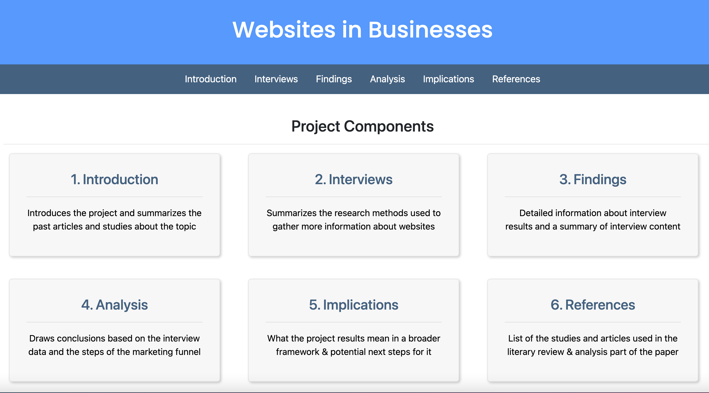

# Advanced Authentic Research Project
Project Topic: The Role of Websites in Local Businesses
## Project Breakdown
Section    | Link   | Content |
| :--- | :---- | :-------------- | 
Home  | [Homepage](https://hannahjzhang.github.io/aar/) | Links to  sub-sections, the complete paper, & the showcase presentation
Introduction   | [Intro](https://hannahjzhang.github.io/aar/pages/intro.html)  | Research question, project overview, & secondary research
Interviews  | [Data](https://hannahjzhang.github.io/aar/pages/interview.html) | Approach to interviews, data collection, analysis plans
Findings   | [Results](https://hannahjzhang.github.io/aar/pages/findings.html)  | Notes on each of the six stores interviewed
Analysis   | [Deductions](https://hannahjzhang.github.io/aar/pages/analysis.html)  | Categorizing results, recommendations for websites
Implications   | [Future](https://hannahjzhang.github.io/aar/pages/implications.html)  | Meaning in a broader context and next steps to consider
References  | [Sources](https://hannahjzhang.github.io/aar/pages/references.html) | Sources used throughout the project

## Demo
